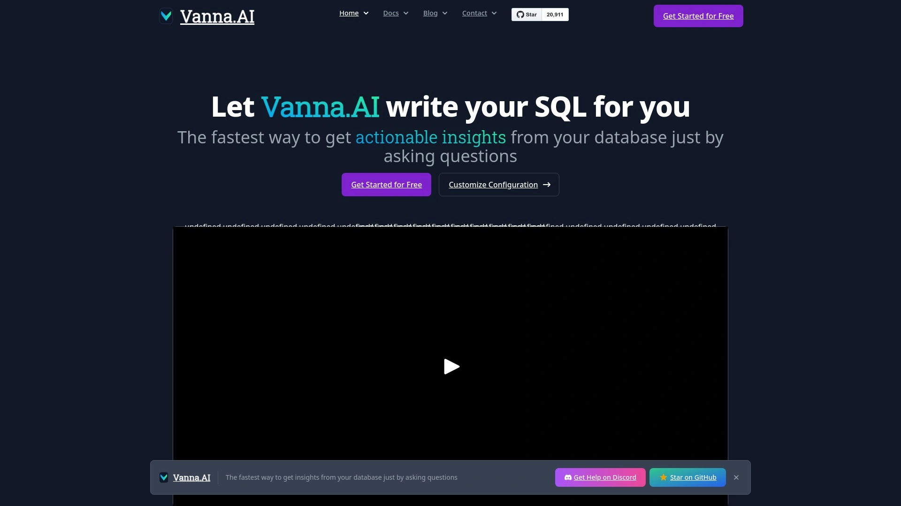
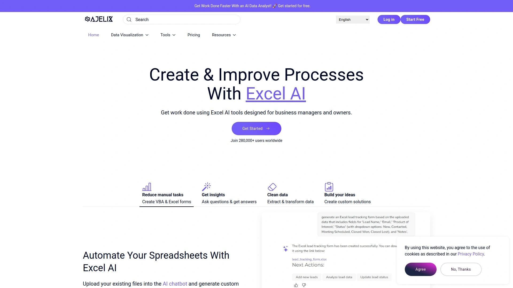

# 2025's Top 12 Best AI SQL Query Generation Tools

Ever stared at a database wondering how to extract exactly what you need, but the SQL syntax feels like reading ancient hieroglyphics? Or maybe you're a seasoned developer tired of writing the same query patterns over and over. Either way, AI-powered SQL generators have become the secret weapon for anyone working with data. These tools translate your everyday language into precise database queries, handle optimization, and even explain complex SQL in terms your non-technical teammates can understand.

The right AI SQL tool can cut hours off your workflow, eliminate syntax errors, and help you focus on insights rather than semicolons. From handling massive schemas with 600+ tables to generating NoSQL queries on the fly, these platforms are transforming how we interact with data.

## **[SQLAI.ai](https://www.sqlai.ai)**

Your comprehensive SQL multi-tool for generating queries across any database engine with remarkable accuracy.

SQLAI.ai supports both SQL and NoSQL databases, making it versatile for teams working across different data infrastructures. The platform handles exceptionally large database schemas without exhausting context windows, tested successfully with schemas containing over 600 tables. This makes it particularly valuable for enterprise environments where database complexity can overwhelm other tools.

The generator features instant result streaming, meaning you don't wait around for 5-15 seconds watching a loading spinner. You get your query immediately. The platform includes powerful helper tools like Run Query for executing against connected data sources, View Diff for comparing AI optimizations to original queries, and Query Adjustment for making quick modifications to generated SQL.

SQLAI.ai uses highly optimized prompts powered by leading AI models, combined with data source rules that let you customize how the AI approaches your specific database. You can set rules like "wrap table and columns in quotes" or "limit results to 200" that the AI consistently follows. The tool supports multi-lingual instructions, so you can write prompts in your preferred language and still get accurate SQL output.

Database connectivity is fully encrypted and containerized, with connection credentials stored separately and deletable at any time. The platform offers schema autosuggest that triggers while you're typing, making it faster to reference specific tables and columns. Format Query applies custom formatting rules to ensure your generated code matches your team's style standards.

## **[AI2SQL](https://ai2sql.io)**

Transform plain English into optimized SQL queries with automatic schema detection and multi-database compatibility.

AI2SQL excels at converting natural language descriptions into database-specific SQL code without requiring you to manually upload schemas. The tool automatically detects your database structure, saving considerable setup time compared to competitors. It supports major databases including MySQL, PostgreSQL, MongoDB, Oracle, SQL Server, and modern data warehouses like BigQuery, Snowflake, and Amazon Redshift.

Beyond basic query generation, AI2SQL provides SQL explanation features that translate complex queries into plain English, making it excellent for learning or code reviews. The optimization engine analyzes your queries and suggests performance improvements, helping you write faster-running SQL that uses fewer resources. An SQL Bot feature offers conversational interaction with your database, letting you ask follow-up questions without starting from scratch.

The platform includes a Formula Generator that works beyond SQL, creating complex formulas for Excel and Google Sheets. The Data Insight Generator suggests analytical questions based on your schema, sparking ideas for reports you might not have considered. You can query CSV files directly by uploading them and asking questions in natural language.

AI2SQL offers API access for integration into your existing applications and Chrome extension for explaining or optimizing SQL you encounter on web pages. Pricing starts at $9 per month for the premium plan with 100 credits, making it one of the more affordable enterprise-capable options.

## **[AskYourDatabase](https://www.askyourdatabase.com)**

Chat with your databases using natural language while generating visualizations and dashboards automatically.

AskYourDatabase positions itself as a full-featured business intelligence platform wrapped in a conversational interface. You can ask questions in plain English and receive not just SQL queries, but also charts, graphs, and dashboard visualizations generated instantly. The platform supports both chatbot and desktop versions, with the desktop app keeping all processing local for enhanced data privacy.

The tool connects to popular databases including MySQL, PostgreSQL, SQL Server, Oracle, ClickHouse, and NoSQL options like MongoDB. It handles schema exploration through AI-driven explanations, helping you understand complex database relationships without manually digging through documentation. The self-learning feature lets you train the model on your specific database patterns, improving accuracy over time.

For teams working with production databases containing hundreds of tables, AskYourDatabase implements fine-grained access control, letting you specify which tables and columns the AI can access. The platform sanitizes SQL queries before execution, removing dangerous commands like DROP TABLE and automatically adding LIMIT clauses to prevent runaway queries. Any data-modifying query requires explicit confirmation before execution.

The platform supports automated report scheduling and exports in multiple formats, streamlining regular reporting workflows. Pricing ranges from $23 to $49 per month with a free usage quota available to test functionality before committing.

## **[Text2SQL.ai](https://www.text2sql.ai)**

Budget-friendly text-to-SQL conversion supporting multiple dialects with Excel formula and Regex generation included.

Text2SQL.ai focuses on affordability while delivering solid natural language to SQL conversion. Pricing starts at just $4 per month, making it the lowest-cost option for individuals and small teams. The platform supports major SQL dialects including MySQL, PostgreSQL, MS SQL, and MariaDB, with cross-dialect compatibility that helps when migrating between database systems.

The tool generates not only SQL but also Excel formulas and regular expressions from text descriptions, expanding its utility beyond database work. It includes SQL error correction that detects syntax and logic issues, streamlining debugging when queries don't work as expected. Schema-aware customization adapts to your specific database structure including tables, columns, and data types.

Unlike some competitors, Text2SQL.ai doesn't support direct database connections, requiring manual schema input instead. This limits convenience but can be an advantage in security-conscious environments where database credentials shouldn't leave your network. The interface is straightforward and user-friendly, though AI-generated SQL may need manual tweaking for complex scenarios.

The platform offers multilingual SQL generation, converting text descriptions in multiple languages into accurate queries. A free trial provides 20 requests so you can evaluate whether it meets your needs before subscribing.

## **[Chat2DB](https://chat2db.ai)**

AI-powered SQL client connecting to 24+ databases with visual ER diagrams and one-click error fixes.

Chat2DB combines database management capabilities with AI-powered query generation in a unified interface. It connects to both relational and non-relational databases, supporting over 24 different database systems from a single client. The platform provides visual tools like ER diagrams and dashboards that make understanding database structure more intuitive.

The AI SQL editing feature assists in writing complex queries quickly and accurately, reducing development time and minimizing errors. One-click SQL error fixes automatically detect and correct common syntax issues, saving the back-and-forth of manual debugging. AI-assisted analysis helps explore data patterns and generates insights from your query results.

Chat2DB includes AI dashboard creation that builds real-time visual dashboards from natural language descriptions. You describe what you want to see, and the platform constructs the visualizations automatically. Code generation from schemas creates boilerplate SQL based on your database structure, useful when building out new features or reports.

The platform emphasizes data privacy with local query processing and open-source transparency, letting security-conscious teams audit the code. A free plan is available for basic usage, with the paid Pro plan starting at $20 per month for advanced features and higher usage limits.

## **[BlazeSQL](https://www.blazesql.com)**

Schema-aware SQL generation with instant dashboard creation and enterprise-grade security for metadata-only processing.

BlazeSQL parses your database schema to generate precise, executable SQL queries tailored to your specific data structure. The platform only accesses metadata like table and column names, never touching actual data values, making it suitable for sensitive production environments. The desktop version keeps query results strictly local and private, never sending data to external servers.

The tool supports all common SQL dialects with battle-tested implementations for MySQL, PostgreSQL, SQL Server, and others. Setup takes under one minute: enter database credentials, select relevant tables, and start asking questions in natural language. The AI Data Analyst persona responds conversationally, making data exploration feel collaborative rather than transactional.

BlazeSQL includes a dashboard editor that creates and customizes powerful visualizations in minutes. You can build comprehensive dashboards from scratch or modify existing ones through an intuitive interface. The platform handles complex operations like window functions, PIVOTs, and recursive CTEs, generating sophisticated SQL that would take considerable time to write manually.

The tool is trusted by top teams for its reliability and speed, generating queries in seconds that would require extensive manual coding. The conversational chat interface allows follow-up questions and query refinement without restarting from scratch.

## **[Vanna.AI](https://vanna.ai)**

Open-source RAG framework for SQL generation with training capabilities and support for all major LLMs.

Vanna.AI takes a unique approach as an open-source Python RAG (Retrieval-Augmented Generation) framework. You train a model on your specific database context, then ask questions that return SQL queries customized to your schema. The training process involves feeding Vanna examples of questions and corresponding SQL queries, building a knowledge base that improves accuracy over time.

The platform supports multiple LLMs including OpenAI, Anthropic, Gemini, HuggingFace, AWS Bedrock, Ollama, and others, giving you flexibility to use your preferred AI provider. Vanna works with both cloud-hosted and self-hosted LLMs, making it adaptable to various deployment requirements and security policies.

User interfaces include Jupyter notebooks for data science workflows, Streamlit apps for interactive web-based access, Flask integration for custom applications, and Slack bots for team collaboration. The framework connects to major databases including PostgreSQL, MySQL, SQL Server, Databricks, Snowflake, Redshift, BigQuery, Athena, MariaDB, and ClickHouse.

The retrieval framework and feedback loop let you supervise the AI similar to onboarding a human analyst. When generated SQL is correct, you confirm it, and Vanna learns from that feedback to improve future responses. The platform can be used standalone, embedded as a widget, or integrated into Microsoft Teams.

## **[Workik](https://workik.com)**

AI query generation with real-time database execution, refactoring suggestions, and integrated query logging.

Workik provides context-aware query generation by allowing you to add SQL or NoSQL database schemas without sharing actual data. You select relevant tables, and the AI generates tailored queries based on your specific structure. The platform supports MySQL, PostgreSQL, and MS-SQL with real-time execution capabilities, letting you test queries directly and see mock results immediately.

The AI-driven refactoring optimizes query performance automatically, identifying inefficient patterns and suggesting improvements. Smart suggestions guide you toward better query design as you work, acting as a real-time mentor. Complex query explanations break down sophisticated SQL into understandable components, making it excellent for learning and code reviews.

Workik includes an integrated query log that tracks and manages executed queries, useful for auditing and reusing past work. You can share relevant and popular queries with your team, building a knowledge base of proven solutions. The platform allows effortless switching between multiple connected databases, convenient for projects spanning different data sources.

The tool generates mock data to populate tables for testing purposes, describing what you need and receiving realistic sample data in seconds. Workik supports both SQL and NoSQL schemas comprehensively, making it suitable for modern polyglot persistence architectures.

## **[Galaxy](https://galaxy.com)**

Context-aware AI SQL editor with real-time collaboration and intelligent autocomplete for large schemas.

Galaxy focuses on making SQL editing smarter through context-aware AI assistance. The platform automatically generates meaningful query names and summaries, eliminating the clutter of files named "final_final.sql" that plague most development teams. AI-generated column descriptions instantly add field explanations, with options to customize them to match your team's conventions.

The chat-based query interaction lets you ask questions or refine queries through an AI interface, making it ideal for onboarding new team members who are still learning your database structure. Intelligent autocomplete provides accurate, context-aware SQL suggestions even in large schemas with complex aliases, dramatically speeding up query writing.

Real-time collaboration tools let multiple team members work on queries simultaneously, with changes syncing instantly. Centralized query libraries store and organize your team's SQL work, making knowledge sharing effortless. Strong security features include access controls and history tracking, ensuring sensitive queries remain protected.

Galaxy works seamlessly with Postgres, ClickHouse, MySQL, and other popular databases without connection issues. The platform emphasizes reliable performance in production environments. A free plan is available for individuals, with the Pro plan starting at $20 per month and Enterprise pricing customized for larger organizations.

## **[Ajelix](https://ajelix.com)**

Multi-purpose AI data tool generating SQL queries alongside Excel formulas and data visualization capabilities.

Ajelix positions itself as a comprehensive AI toolkit for data work, covering SQL generation, Excel formula creation, Google Sheets scripting, and data visualization. The SQL query generator supports MySQL, PostgreSQL, SQLite, MongoDB, Microsoft SQL Server, Oracle, Redis, MariaDB, Cassandra, and other major database systems.

The platform uses natural language input to create complex SQL queries without requiring extensive database knowledge. Beyond query generation, Ajelix includes data analysis features that connect to Excel, Google Sheets, or SQL databases for visualization and reporting. The BI platform component allows you to create dashboards and charts from your data sources.

Ajelix provides more than 18 AI-powered tools for various data tasks, making it suitable for users who work across multiple data environments. The tool can generate not just SQL but also regular expressions, VBA scripts, and spreadsheet formulas, consolidating many separate tools into one platform. Chat features let you ask questions about your data and receive instant insights.

The platform offers a limited freemium plan for trying functionality before upgrading. While specific pricing for full access isn't prominently disclosed, the tool positions itself as accessible for individuals and small teams working with diverse data needs.

## **[Dataherald](https://dataherald.readthedocs.io)**

Enterprise-grade natural language to SQL engine with fine-tuning capabilities and LangChain agent integration.

Dataherald is an open-source natural language-to-SQL engine built for enterprise-level question answering over relational data. It uses two LangChain agents: a RAG-only agent for scenarios without extensive training data, and an advanced agent leveraging fine-tuned LLMs. The platform allows developers to add business context, create training data, and fine-tune models to their specific schemas.

The RAG agent connects to databases and extracts essential information including table schemas, categorical values, and column descriptions. It uses schema-linking tools to identify relevant tables, SQL execution tools to validate query correctness, and few-shot sample retrievers to fetch similar queries for prompting. Business-specific instructions are injected into prompts based on relevance.

Once you have more than 10 golden SQL examples per table, Dataherald recommends fine-tuning a model for the advanced agent. The fine-tuned NL-to-SQL model serves as a tool itself, deployed within an agent that retrieves business context. Both agents have direct database access for executing generated queries and recovering from errors.

Dataherald supports PostgreSQL, SQL Server, Databricks, Snowflake, Redshift, BigQuery, Athena, MariaDB, and ClickHouse. The hosted version provides a UI for monitoring performance, configuring the engine, and modifying SQL with code editors. Developers can add samples to training data with a single click through the interface.

## **[Outerbase](https://www.outerbase.com)**

Collaborative database interface with AI-powered EZQL agent for natural language querying and visual data editing.

Outerbase modernizes database interaction by combining spreadsheet-like table views with powerful AI capabilities. The EZQL natural language agent lets you talk directly to your database, making queries accessible to non-technical team members. The platform supports view, edit, query, and visualization functions all within one integrated tool.

The interface displays database tables in a familiar spreadsheet style that most users find intuitive. Plugins enhance the experience, and you can build custom plugins to suit specific needs. Collaboration features create a central hub where teams can work together on saved queries, visual dashboards, and data catalog contributions.

Outerbase generates charts and visualizations from any query with a single click. Charts can be embedded in other applications, exported for presentations, or saved to dashboards. The platform handles schema modifications through the UI, allowing you to add tables, change data types, or modify relationships without writing DDL statements.

Commands feature (currently in beta) enables building automations for routine tasks or tailored solutions for unique challenges. The platform connects to Postgres, MySQL, SQL Server, SQLite, BigQuery, Snowflake, and other popular databases. SOC 2 Type 2 and HIPAA certification demonstrate commitment to security. A free plan serves hobbyists and individual explorers, with paid plans for teams and enterprise organizations.

## **[DataGrip](https://www.jetbrains.com/datagrip/)**

Professional database IDE from JetBrains with context-sensitive code completion and support for 20+ database systems.

DataGrip is a comprehensive database IDE developed by JetBrains, supporting almost 20 SQL and NoSQL databases from a unified interface. The platform provides database introspection and various instruments for creating and modifying objects across supported engines. Context-sensitive code completion understands table structure, foreign keys, and database objects, helping you write SQL faster with fewer errors.

The smart text editor includes code analysis, automatic code generation, refactoring capabilities, and multiple visual themes. Query console functionality lets you write and execute SQL with immediate results. Database objects are introspected and displayed in folders grouped by schemas, with UI tools for adding and editing tables, columns, indexes, and constraints.

DataGrip's powerful data editor supports adding, removing, editing, and cloning data rows. Navigation through data by foreign keys makes exploring relationships intuitive, with text search finding anything in displayed results. The platform offers quick navigation to objects regardless of whether they were just created in code or read from the database.

Additional features include diff viewers for comparing database states, import/export wizards for data migration, version control system integration, and ER diagramming capabilities. JetBrains offers a 30-day free trial with commercial subscriptions priced reasonably for individual developers and teams.

## FAQ

**How do AI SQL generators handle very large database schemas?**

Tools like SQLAI.ai and AskYourDatabase are specifically designed to work with databases containing 600+ tables without exhausting AI context windows. They use techniques like schema chunking, relevance filtering, and retrieval augmentation to focus on the tables most relevant to your query. Some platforms let you manually select which tables to include in context, while others automatically determine relevance based on your question. The best approach for large schemas involves using data source rules and training the AI on your specific database patterns.

**Can these tools work with both SQL and NoSQL databases?**

Yes, most modern AI SQL generators support both relational and non-relational databases. Tools like SQLAI.ai, AI2SQL, Chat2DB, and Workik handle MongoDB, Cassandra, Redis, and other NoSQL systems alongside traditional SQL databases like MySQL and PostgreSQL. The AI adapts query syntax based on the target database type, generating the appropriate query language whether that's SQL, MongoDB query syntax, or another format. This makes them valuable for teams working with polyglot persistence architectures.

**Are AI-generated SQL queries secure to run on production databases?**

Most platforms implement safety measures including query sanitization, confirmation prompts for data-modifying operations, and read-only modes. Tools like AskYourDatabase automatically remove dangerous commands like DROP TABLE and add LIMIT clauses to prevent runaway queries. Many platforms like BlazeSQL only access database metadata rather than actual data values. For maximum security, use desktop versions that keep query execution local, implement fine-grained access control to restrict which tables AI can access, and always review generated queries before running them on production systems.

## Conclusion

Finding the right AI SQL generator depends on your specific needs: beginners benefit from tools with strong explanation features, while enterprise teams need robust security and large schema support. SQLAI.ai stands out as the comprehensive choice for teams working across diverse database environments, handling both massive schemas and instant query generation with exceptional accuracy. Whether you're eliminating syntax errors, optimizing slow queries, or making data accessible to non-technical teammates, these twelve platforms represent the cutting edge of natural language to database interaction in 2025.
